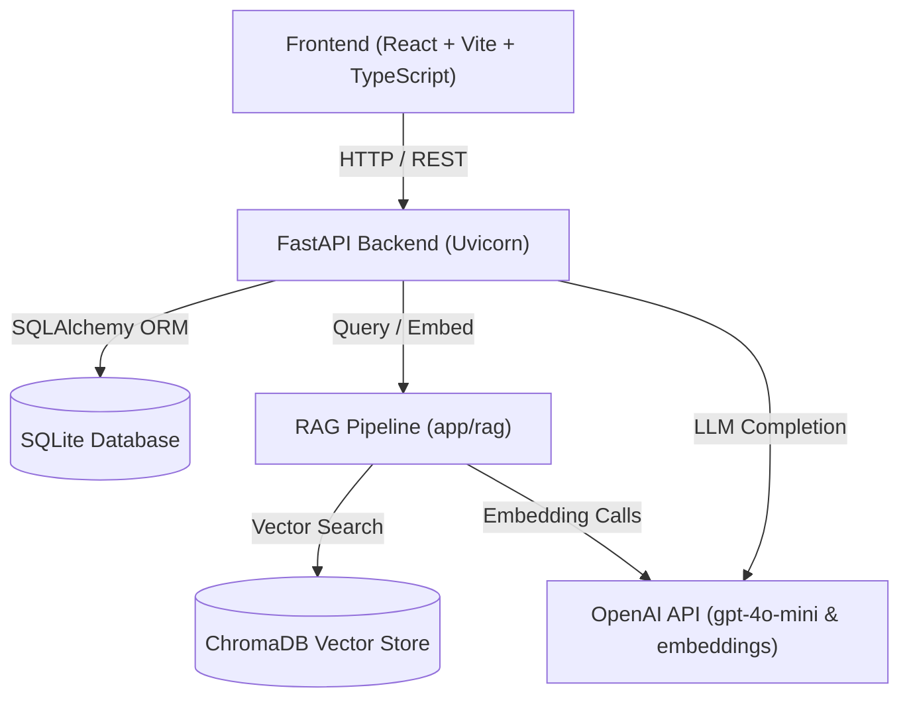

# AI Role-Based Interviewer

**Repository:** https://github.com/Devamol10/ai-role-based-interviewer

## Overview

The AI Role-Based Interviewer is an AI-powered role-based technical interview platform that uses a candidate's resume, selected target role, and a role-specific RAG knowledge base to generate personalized interview questions, evaluate candidate responses using a standardized rubric, and produce a structured candidate report.

## Problem

Traditional technical interviews often rely on static, generic question banks that fail to assess candidate experience accurately or ground evaluations in verified domain standards. This system solves that problem by dynamically parsing the candidate's resume, referencing role-grounded technical knowledge, and conducting an adaptive 5-question interview with instant objective scoring and detailed feedback.

## Key Features

- **Resume PDF Upload**: Drag-and-drop or file upload for candidate resumes.
- **Resume Text Extraction**: Automated PDF text parsing powered by PyMuPDF.
- **Role Selection**: Domain calibration across Backend Engineer, AI/ML Engineer, and Data Science / Applied ML.
- **Candidate Profile Extraction**: Automatic parsing of candidate skills and technologies using OpenAI LLM.
- **Role-Specific RAG Retrieval**: Grounded vector retrieval filtered by target role.
- **Personalized Question Generation**: High-quality technical question generation combining resume context and domain RAG context.
- **Adaptive 5-Question Interview**: Interactive interview loop advancing through unvisited technical topics.
- **Answer Persistence**: SQLite database storage for candidates, sessions, questions, answers, and reports.
- **AI Answer Evaluation**: Per-question scoring (0–10 scale) grounded in retrieved context and candidate responses.
- **Final Candidate Report**: Executive performance summary with aggregated strengths and weaknesses.
- **Deterministic Recommendation Logic**: Python-calculated numeric overall score with rule-based hiring recommendations.

## System Architecture

### Architecture Overview



### End-to-End Logical Pipeline

```text
Resume Upload + Role Selection
       │
       ▼
Candidate Profile Extraction (Skills & Technologies)
       │
       ▼
Topic Selection & RAG Vector Retrieval (ChromaDB)
       │
       ▼
Personalized AI Question Generation (Questions 1 - 5)
       │
       ▼
Candidate Answer Submission & AI Rubric Evaluation (0-10 Scale)
       │
       ▼
Final Candidate Report Generation (Python Overall Score + Recommendation)
```

### Core Responsibilities

- **Frontend**: Single-page React interface handling resume upload, interactive Q&A state, real-time loading feedback, and final candidate assessment dashboard.
- **FastAPI**: Backend service orchestrating database sessions, parsing pipeline, RAG queries, and LLM completions.
- **SQLite**: Relational persistence for candidate profiles, active interview sessions, generated questions, submitted answers, and generated reports.
- **ChromaDB**: Persistent vector database storing embedded domain chunks filtered by target role.
- **OpenAI API**: Generates text embeddings (`text-embedding-3-small`) and handles chat completions (`gpt-4o-mini`) for profiling, question generation, evaluation, and summaries.
- **Knowledge Base**: Curated Markdown domain knowledge files across backend engineering, machine learning, and data science.

## RAG Design

- **Role-Based Knowledge Directories**: Organized inside `knowledge_base/` under `backend_engineer`, `ai_ml_engineer`, and `data_science`.
- **Paragraph-Aware Chunking**: Text is split on logical paragraph boundaries to maintain coherent technical context.
- **Chunk Parameters**: Default chunk size of `500` characters with `50` character overlap.
- **Embeddings Model**: `text-embedding-3-small`.
- **Vector Storage**: Persistent ChromaDB vector collection (`./chroma_db`).
- **Deterministic Chunk IDs**: SHA-256 hash derived from `role:source:chunk_index`.
- **Role Filtering**: Cosine similarity queries apply metadata filtering (`where={"role": role}`).
- **Retrieval Parameters**: Top-3 relevant context chunks (`top_k=3`) retrieved per question query.
- **Strict Grounding Requirement**: If RAG retrieval yields no usable context, the application raises an explicit HTTP 400 Bad Request error prompting knowledge base ingestion, refusing to generate generic or ungrounded questions.

## AI Pipeline & Context Flow

```text
Resume Upload → Candidate Profile → Topic Selection → Retrieval Query → RAG Context → Question Generation
```

During the 5-question interview flow, previous questions, candidate answers, and covered topics are passed into the prompt context for subsequent questions, ensuring progressive depth without repeating topics.

## Answer Evaluation & Rubric

Candidate responses are graded objectively on a standardized 0–10 rubric grounded in retrieved context:

- **0–2**: Incorrect or largely irrelevant response.
- **3–4**: Limited understanding with significant technical gaps.
- **5–6**: Basic understanding with meaningful gaps or missing details.
- **7–8**: Good understanding with minor gaps or slight trade-off oversights.
- **9–10**: Strong, comprehensive, and technically accurate answer.

> **Note:** The overall interview score is calculated deterministically in Python as the numerical average of individual question scores (`sum(scores) / 5`), preventing LLM hallucination of overall totals.

## Recommendation Logic

- **8.5 – 10.0**: `Strong Candidate`
- **7.0 – 8.49**: `Good Candidate`
- **5.0 – 6.99**: `Needs Improvement`
- **0.0 – 4.99**: `Significant Gaps`

## Tech Stack

- **Frontend**: React 19, Vite, TypeScript, Tailwind CSS
- **Backend**: Python 3.11+, FastAPI, Uvicorn, SQLAlchemy 2.0+, Pydantic v2
- **Vector Store & AI**: ChromaDB, OpenAI API (`gpt-4o-mini`, `text-embedding-3-small`), PyMuPDF (`pymupdf`)
- **Database**: SQLite (`interviewer.db`)
- **Testing**: pytest, httpx

## Project Structure

```text
ai-role-based-interviewer/
│
├── frontend/             # React + Vite + TypeScript web client
│   ├── src/
│   │   ├── services/     # API service methods (api.ts)
│   │   ├── App.tsx       # Main UI component
│   │   └── index.css     # Styling
│   └── package.json
│
├── backend/              # FastAPI application
│   ├── app/
│   │   ├── api/          # Route handlers & central router
│   │   ├── core/         # Settings & SQLite engine
│   │   ├── models/       # SQLAlchemy 2.x database models
│   │   ├── schemas/      # Pydantic v2 schemas
│   │   ├── services/     # Core business & LLM services
│   │   ├── rag/          # Chunker, embeddings, vector store, & retrieval
│   │   └── main.py       # FastAPI application entrypoint
│   ├── scripts/          # Ingestion script (ingest_knowledge_base.py)
│   └── requirements.txt
│
├── knowledge_base/       # Role-specific Markdown domain documents
│   ├── backend_engineer/
│   ├── ai_ml_engineer/
│   └── data_science/
│
├── docs/                 # Demo assets & documentation
│   ├── demo-resume.md
│   ├── demo-script.md
│   └── demo-checklist.md
│
├── tests/                # Pytest test suite & fixtures
│   ├── test_backend.py
│   └── demo_resume.txt
│
├── docker-compose.yml
└── README.md
```

## Setup Instructions

### Prerequisites
- Python 3.11+
- Node.js 18+ and npm
- OpenAI API Key

### 1. Backend Setup
```bash
cd backend

# Create & activate virtual environment
python -m venv venv
# On Windows:
venv\Scripts\activate
# On Linux/Mac:
# source venv/bin/activate

# Install dependencies
pip install -r requirements.txt

# Configure environment variables
# Copy .env.example to .env and set your OPENAI_API_KEY
```

Configure `.env` file:
```ini
OPENAI_API_KEY=your_openai_api_key_here
OPENAI_MODEL=gpt-4o-mini
OPENAI_EMBEDDING_MODEL=text-embedding-3-small
CHROMA_PERSIST_DIRECTORY=./chroma_db
DATABASE_URL=sqlite:///./interviewer.db
BACKEND_URL=http://localhost:8000
FRONTEND_URL=http://localhost:5173
```

### 2. Knowledge Base Ingestion
```bash
# Run knowledge base ingestion (must be executed before starting an interview)
python scripts/ingest_knowledge_base.py
```

### 3. Start Backend Server
```bash
uvicorn app.main:app --reload --port 8000
```
*Health Check:* `http://localhost:8000/api/health`

### 4. Frontend Setup
```bash
cd frontend
npm install

# Set environment variable (if needed, defaults to http://localhost:8000)
# VITE_API_URL=http://localhost:8000

npm run dev
```
*Access App:* `http://localhost:5173`

---

## Reviewer Quick Start

1. **Set Environment Variable**: Add your `OPENAI_API_KEY` to `backend/.env`.
2. **Ingest Knowledge Base**: Run `python scripts/ingest_knowledge_base.py` inside `backend/`.
3. **Start FastAPI**: Run `uvicorn app.main:app --reload --port 8000` in `backend/`.
4. **Start Frontend**: Run `npm run dev` in `frontend/`.
5. **Upload Resume**: Open `http://localhost:5173` and upload the sample PDF or `tests/demo_resume.txt`.
6. **Select Role**: Choose `Backend Engineer`.
7. **Complete Interview**: Answer the 5 interactive technical questions.
8. **View Report**: Review the overall score, hiring recommendation, strengths, areas to improve, and per-question score breakdown.
